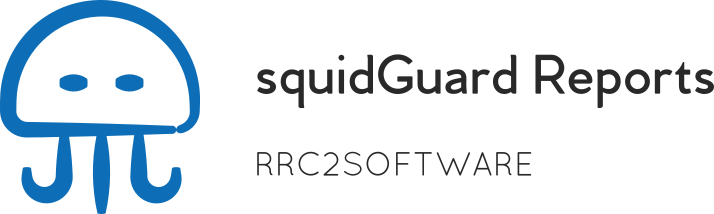

# squidGuard Reports

squidGuard Reports es una aplicación que se encarga de parsear los archivos de registro generados por squidGuard, para ser procesados y presentados mediante el uso de una interfaz Web.

## Características

- Interfaz Web facil e intuitiva.
- Informes diferenciados por fecha, usuario/dirección ip, sitios y clasificaciones.
- Informes detallados por horas para los accesos de los usuarios/direcciones ip.

## Instalación

1. Clonar el repositorio en una ruta accesible desde el servidor Web.
```
cd /var/www/html
git clone https://github.com/ramonromancastro/squidguard-reports.git
```
2. Crear los archivos de configuración y establecer las opciones de configuración.
```
cp squidguardparser.template.cfg squidguardparser.cfg
cp config.template.php config.php
```
3. Crear las tareas programadas que se encargan de la recolección de los archivos de registro.
```
tee /etc/cron.daily/squidguard-reports.cron << EOF
#!/bin/bash
perl /var/www/html/squidguard-reports/squidguardparser.pl yesterday
EOF
chmod +x /etc/cron.daily/squidguard-reports.cron
tee /etc/cron.d/squidguard-reports.cron << EOF
0 8-20 * * * root /var/www/html/squidguard-reports/squidguardparser.pl today" > /etc/cron.d/squidguard-reports.cron
EOF
```
4. Ejecutar squidguardparser.pl para la recolección inicial de los datos del registro.
```
perl /var/www/html/squidguard-reports/squidguardparser.pl
```

## Recursos adicionales

* [Sitio Web oficial](http://squidguard-reports.rrc2software.com)
* [Repositorio GitHub](https://github.com/ramonromancastro/squidguard-reports)
